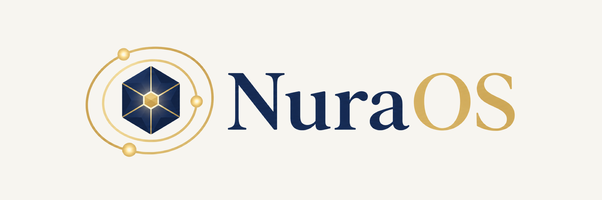
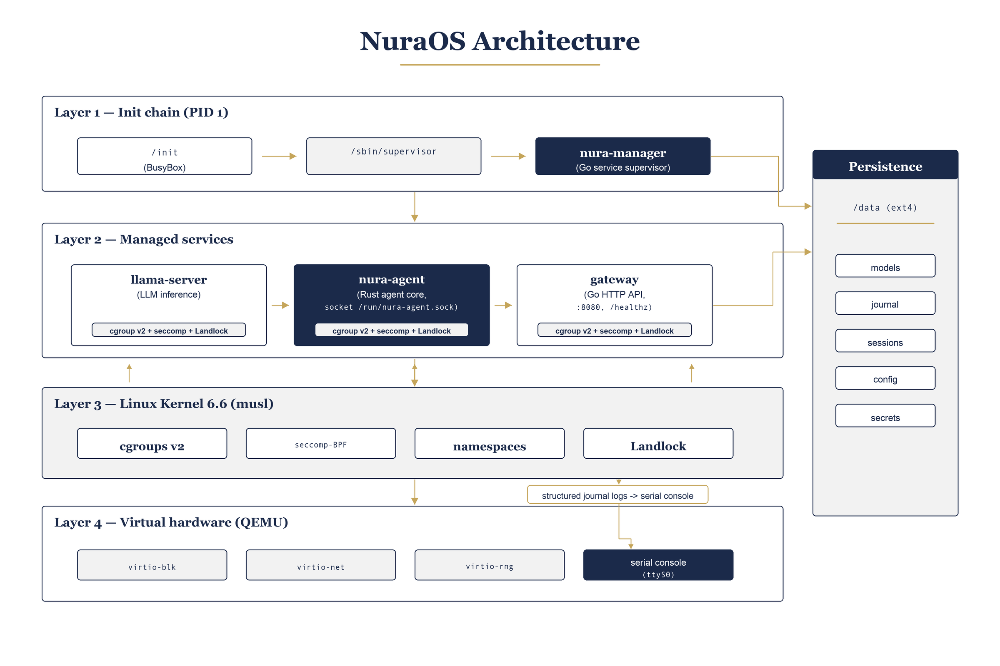

<p align="center">
  
</p>

<h1 align="center">NuraOS</h1>

<p align="center">
  A purpose-built, headless operating system for on-device AI inference.<br>
  Raw Linux kernel. Static musl userland. No Buildroot. No desktop. No noise.
</p>

<p align="center">
  
  
  
  
</p>

---

## Overview

NuraOS is a minimal appliance OS designed around a single objective: run an AI agent locally, with no cloud dependency, on bare metal or a QEMU VM. The system boots directly into `nura-manager`, a lightweight service supervisor that starts the inference engine, the Rust agent core, and the HTTP gateway. Every component is statically linked, pinned to a verified source, and confined by its own cgroup v2 slice, seccomp-BPF filter, and Landlock ruleset.

**Core properties:**

| Property | Detail |
|---|---|
| Local-first | llama.cpp runs on-CPU by default. Remote providers are opt-in. |
| Minimal | Every binary is justified by the boot-to-agent path. |
| Reproducible | All sources are version-pinned. Builds are fully deterministic. |
| Auditable | Every interaction is written to an append-only, hash-chained journal. |
| Secure | No shell exposed by default. Seccomp + Landlock on all long-running services. |

---

## Why Not Just a Minimal Linux Image?

A minimal embedded Linux for a single application is a solved problem. Yocto, Buildroot, and LXC all do that well. NuraOS is solving a different problem.

When the application is a language model with tool-calling capabilities, the OS has to answer questions those tools were never designed for:

**What can the model touch?**
NuraOS enforces filesystem boundaries at the kernel level using Landlock and mount namespaces, not application code that can be bypassed or misconfigured.

**What syscalls can the inference process make?**
A per-service seccomp-BPF profile limits the kernel surface the model runtime can reach, shaped specifically around what an inference process needs and nothing else.

**What resources can it consume?**
cgroup v2 limits bound CPU, memory, and IO per service so inference cannot starve the control plane or destabilise the system under load.

**What did it do?**
Every prompt, tool call, and completion is recorded in an append-only, cryptographically chained provenance log on the device — verifiable without external infrastructure.

**Where did inference happen?**
A provider abstraction with residency-aware routing keeps sensitive turns on local or sovereign endpoints by policy, with every routing decision logged.

LXC isolates containers on top of an existing OS. NuraOS removes the existing OS and replaces it with one designed around the AI agent. The kernel configuration, the seccomp profiles, the Landlock rules, the cgroup topology, and the provenance chain exist because of what a language model with tool-calling capabilities specifically needs — and must not be able to do. That co-design is what makes the guarantees real.

---

## Architecture

<p align="center">
  
</p>

The boot sequence goes from kernel init through a BusyBox `/init` script that mounts the `/data` ext4 partition, then hands off to `nura-manager`. Three services come up in parallel: `llama-server` (inference), `nura-agent` (Rust agent core), and `gateway` (HTTP API). All service-to-service communication is over Unix sockets; only the gateway is exposed externally via virtio-net.

---

## Build Pipeline

```
kernel.org tarball  (pinned tag, SHA-verified)
        |
        v
  bzImage  (tinyconfig x86-64 + NuraOS config fragments)
        |
  musl-gcc cross toolchain
        |
        v
  BusyBox (static)
  nura-agent (Rust, musl target)
  llama-server (llama.cpp, CPU-only, fully static)
  gateway (Go, musl CGO_ENABLED=0)
        |
        v
  initramfs.cpio.gz  (cpio archive, no /dev nodes committed)
        |
  data.img  (ext4: models, journal, sessions, config, secrets)
        |
        v
  QEMU x86-64  (serial on stdio, virtio-blk /data, user-mode net)
```

---

## Directory Layout

```
kernel/         Kernel config fragments and patches (source fetched, not committed)
rootfs/         /init script, rootfs skeleton, seccomp/landlock profiles, BusyBox config
services/       Go workspace: HTTP gateway and supporting services
agent/          Rust workspace: nura-agent binary and nura-core library
scripts/        Build, fetch, release, and operator helper scripts
image/          Image assembly and build outputs (bzImage, initramfs, data.img)
third_party/    Pinned vendored sources: llama.cpp
docs/           Architecture decision records, runbooks, operator guides
```

---

## Quick Start

**Prerequisites:** `gcc`, `make`, `bc`, `bison`, `flex`, `libssl-dev`, `libelf-dev`, `cpio`, `qemu-system-x86`, `musl-tools`, `cmake`, Go >= 1.23, Rust >= 1.87.

```sh
# 1. Verify host prerequisites
./scripts/check-host.sh

# 2. Fetch and verify the kernel source
./scripts/fetch-kernel.sh

# 3. Build the complete image (kernel + userland + initramfs + data.img)
./scripts/build-image.sh

# 4. Boot in QEMU
./scripts/run-qemu.sh
```

The gateway is reachable at `http://localhost:18080` once the VM reports ready on serial.

For inference with llama-server, see **[Inference Image](#inference-image)** below.

Full host setup instructions: [docs/host-setup.md](docs/host-setup.md)

---

## Gateway API

All endpoints require `Authorization: Bearer <token>` when `gateway_token` is set in `/data/etc/secrets.toml`.

```sh
export BASE=http://localhost:18080

curl $BASE/healthz                        # Liveness
curl $BASE/status                         # Full health summary
curl $BASE/version                        # Version string
curl $BASE/config                         # Effective config (secrets redacted)
curl $BASE/models                         # Active model + installed GGUF list
curl $BASE/tools                          # Registered agent tools
curl $BASE/metrics                        # Prometheus counters
curl $BASE/update/status                  # A/B slot state
curl $BASE/telemetry/status               # Telemetry on/off

# Streaming inference (SSE)
curl -X POST $BASE/chat \
  -H "Content-Type: application/json" \
  -d '{"messages":[{"role":"user","parts":[{"type":"text","text":"Hello"}]}]}'
```

**Endpoint reference:**

| Endpoint | Method | Description |
|---|---|---|
| `/healthz` | GET | Agent and gateway liveness probe |
| `/version` | GET | Service name and version string |
| `/chat` | POST | Streaming SSE inference turn |
| `/tools` | GET | List of registered agent tools |
| `/metrics` | GET | Prometheus text format counters |
| `/status` | GET | Human-readable health summary across all components |
| `/config` | GET | Effective runtime configuration (no secrets) |
| `/models` | GET | Active model manifest and available GGUF inventory |
| `/update/status` | GET | A/B slot and last update result |
| `/telemetry/status` | GET | Telemetry pipeline status |
| `/board` | GET | Hardware board identification |

---

## Inference Image

The default image does not include `llama-server` (the binary is large and build time is significant). An opt-in CI workflow builds a fully inference-ready image with a baked-in model and uploads it as a downloadable artifact.

**Trigger from the Actions tab:**

```
Workflow: "Build inference image (opt-in)"
Inputs:
  model_url   — GGUF download URL (default: Qwen2.5-0.5B-Instruct Q4_K_M)
  model_name  — model name without extension
```

**Boot the artifact:**

```sh
qemu-system-x86_64 \
  -machine q35,accel=tcg \
  -cpu Haswell \
  -m 3072 -smp 4 \
  -kernel bzImage \
  -initrd initramfs.cpio.gz \
  -drive file=data.img,format=raw,if=virtio,cache=writeback \
  -netdev user,id=n,hostfwd=tcp::18081-:8081 \
  -device virtio-net-pci,netdev=n \
  -append "console=ttyS0,115200 nokaslr panic=5 loglevel=7"
```

**Query inference directly** (the `/chat` gateway path is not yet wired to the inference loop):

```sh
curl http://localhost:18081/v1/chat/completions \
  -H "Content-Type: application/json" \
  -d '{"model":"local","messages":[{"role":"user","content":"Hello"}]}'
```

Note: `-cpu Haswell` is required. The default `qemu64` CPU lacks SSSE3/BMI2, which llama.cpp baseline kernels require.

---

## Model Management

```sh
# Download the default model into /data/models
bash scripts/fetch-model.sh

# List installed models
bash scripts/model-list.sh

# Switch the active model
bash scripts/model-activate.sh <model-name> --quantization Q4_K_M
```

---

## Provider Configuration

```sh
./scripts/configure.sh
```

| Provider | Activation |
|---|---|
| `local` | Default. llama.cpp on-CPU via `llama-server`. |
| `anthropic` | Set `ANTHROPIC_API_KEY` in `/data/etc/secrets.toml`. |
| `openai` | Set `OPENAI_API_KEY` in `/data/etc/secrets.toml`. |
| `ollama` | Set `NURA_OLLAMA=1` and point to the Ollama host. |
| `lm-studio` | Set `NURA_LMSTUDIO=1`. |
| `custom` | Set `NURA_CUSTOM_ENDPOINT=http://...`. |

The active provider can be overridden per request with `"provider": "<name>"` in the chat body.

---

## A/B Safe Updates

```sh
# Stage a new rootfs image to the inactive slot
bash scripts/update.sh --url https://example.com/nuraos.ext4 --sha256 <hex>

# Activate the staged slot and reboot
bash scripts/slot-select.sh set b && reboot

# Roll back to the previous slot
bash scripts/update.sh --rollback && reboot
```

---

## Smoke Test

```sh
# Against a local gateway (default: localhost:8080)
bash scripts/smoke-test.sh

# Against a remote target
bash scripts/smoke-test.sh --base-url http://192.168.1.100:8080 --token <token>
```

---

## License

MIT. See [LICENSE](LICENSE).
